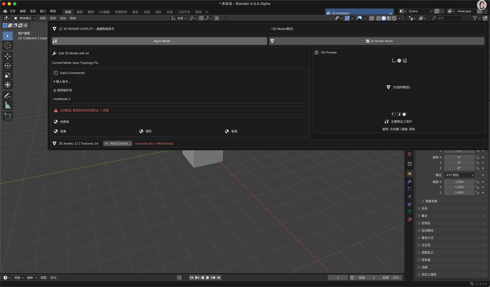

<!--
Keep this document short & concise,
linking to external resources instead of including content in-line.
See 'release/text/readme.html' for the end user read-me.
-->

# Blender AI 助手架构分析

## 1. 整体架构

```
+------------------------------------------+
|              Blender UI 层               |
|  +--------------+    +----------------+ |
|  | AI Assistant |    | 3D Moder Mode | |
|  | (Agent Mode) |    | (建模助手)     | |
|  +--------------+    +----------------+ |
+------------------------------------------+
              |                |
              v                v
+------------------------------------------+
|            消息处理与分发层              |
|  +----------------+  +----------------+  |
|  | 命令解析器     |  | 消息历史管理   |  |
|  +----------------+  +----------------+  |
+------------------------------------------+
              |                |
              v                v
+------------------------------------------+
|              核心功能层                  |
|  +----------------+  +----------------+  |
|  | AI Agent 引擎  |  | 3D建模操作引擎 |  |
|  +----------------+  +----------------+  |
+------------------------------------------+
              |                |
              v                v
+------------------------------------------+
|            Blender API 集成层            |
|  +----------------+  +----------------+  |
|  | Python API     |  | C/C++ 底层API  |  |
|  +----------------+  +----------------+  |
+------------------------------------------+
```



## 2. 核心组件分析

### 2.1 UI 层组件

#### AI Assistant (Agent Mode)
- **实现文件**: `scripts/startup/bl_ui/space_ai_sidebar.py`
- **主要类**:
  - `VIEW3D_PT_ai_assistant`: 主面板类
  - `AIAssistantProperties`: 属性存储类
  - `AIMessageItem`: 消息项类
  - `AI_UL_messages`: 消息列表UI类
  - `AI_OT_send_message`: 发送消息操作类

#### 3D Moder Copilot
- **实现文件**: `scripts/startup/bl_ui/space_3d_moder.py`
- **主要类**:
  - `VIEW3D_PT_3d_moder_copilot`: 主面板类
  - `MoCoProperties`: 属性存储类
  - `MOCO_OT_send_command`: 发送命令操作类

### 2.2 消息处理层

- **命令解析**: 处理以 `/` 开头的特殊命令
- **消息历史管理**: 通过 `CollectionProperty` 存储消息历史
- **模式切换**: 在 Agent 模式和 3D Moder 模式之间切换

### 2.3 核心功能层

#### AI Agent 引擎
- 处理自然语言指令
- 执行通用AI助手功能
- 提供对话式交互

#### 3D建模操作引擎
- 处理3D模型导入/导出
- 执行模型优化操作
- 提供UV展开、材质应用等功能

## 3. 初始化流程

1. **注册属性组**:
   - `AIAssistantProperties` 注册到 `bpy.types.Scene`
   - `MoCoProperties` 注册到 `bpy.types.Scene`

2. **初始化操作**:
   - `AI_OT_initialize`: 初始化AI助手
   - `MOCO_OT_initialize`: 初始化3D Moder

3. **面板注册**:
   - 将面板类注册到Blender UI系统
   - 设置默认属性值

## 4. 消息处理流程

1. **用户输入**:
   - 用户在输入框中输入消息或命令
   - 点击发送按钮触发处理

2. **命令解析**:
   - 检查是否为特殊命令（以 `/` 开头）
   - 如果是命令，则解析并执行相应操作
   - 如果是普通消息，则传递给AI处理

3. **响应生成**:
   - AI生成响应或执行命令后的结果
   - 将响应添加到消息历史中
   - 更新UI显示

## 5. 文件结构

```
scripts/startup/bl_ui/
  ├── space_ai_sidebar.py  # AI Assistant实现
  └── space_3d_moder.py    # 3D Moder实现
```

## 6. 入口点分析

主要入口点在Blender启动时注册的UI面板和操作类:

1. **UI面板注册**:
   - `VIEW3D_PT_ai_assistant`
   - `VIEW3D_PT_3d_moder_copilot`

2. **操作类注册**:
   - `AI_OT_send_message`
   - `MOCO_OT_send_command`

3. **初始化操作**:
   - `AI_OT_initialize`
   - `MOCO_OT_initialize`

## 7. 服务初始化分析

从代码分析来看，AI助手服务初始化主要包括:

1. **属性组初始化**:
   - 创建消息历史存储
   - 设置默认模式
   - 初始化UI状态

2. **操作类注册**:
   - 注册消息发送操作
   - 注册命令执行操作
   - 注册模式切换操作

3. **UI组件初始化**:
   - 创建消息列表
   - 创建输入区域
   - 创建模式切换按钮

## 8. 总结

Blender AI助手采用了模块化的架构设计，主要分为Agent模式和3D Moder模式两个主要功能模块。系统通过Blender的属性系统和操作类机制，实现了AI助手的核心功能，包括消息处理、命令执行和UI交互。

整个系统的入口点是UI面板的注册和初始化，通过Blender的插件机制集成到主界面中。服务初始化主要包括属性组、操作类和UI组件的初始化，为用户提供了直观的交互界面和强大的AI辅助功能。


Project Pages
-------------

- [Main Website](http://www.blender.org)
- [Reference Manual](https://docs.blender.org/manual/en/latest/index.html)
- [User Community](https://www.blender.org/community/)

Development
-----------

- [Build Instructions](https://developer.blender.org/docs/handbook/building_blender/)
- [Code Review & Bug Tracker](https://projects.blender.org)
- [Developer Forum](https://devtalk.blender.org)
- [Developer Documentation](https://developer.blender.org/docs/)


License
-------

Blender as a whole is licensed under the GNU General Public License, Version 3.
Individual files may have a different, but compatible license.

See [blender.org/about/license](https://www.blender.org/about/license) for details.
