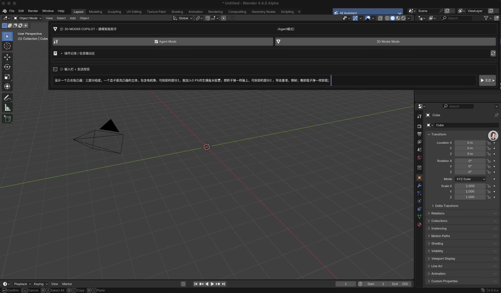

# 3D Moder Copilot

[](https://zyxcambridge.github.io/blender_llm/)

## AI-Powered Assistant for Blender

3D Moder Copilot is an innovative AI assistant that seamlessly integrates with Blender, providing intelligent assistance for 3D modeling, animation, and rendering tasks. Built on Claude 3.7 Sonnet by Anthropic, this tool understands natural language commands and translates them into precise Blender operations.

### 🌟 Key Features

- **Natural Language Control**: Control Blender using conversational commands
- **Auto Mesh Optimization**: Automatically detect and fix topology issues
- **Material Generation**: Generate complex materials with simple text descriptions
- **Rigging Assistance**: AI-guided bone placement and weight painting
- **3D Model Import**: Import and optimize models from various formats
- **Voice Control**: Hands-free modeling experience

### 🚀 Getting Started

```bash
# Clone the repository
git clone https://github.com/zyxcambridge/blender_llm.git

# Build Blender with the plugin
cd blender_llm
make -j16

# Run Blender with 3D Moder Copilot
./build_darwin/bin/Blender.app/Contents/MacOS/Blender
```

### 📖 Usage

1. Launch Blender with the 3D Moder Copilot plugin
2. Click on the "3D MODER COPILOT" button in the top-right corner
3. Select between "Agent Mode" or "3D Moder Mode"
4. Type commands in the input box or use voice control

### 🎥 Demo

**[点击查看在线演示](https://zyxcambridge.github.io/blender_llm/)** - 访问我们的网站，观看3D Moder Copilot的功能演示视频。

**[下载演示视频](https://github.com/zyxcambridge/blender_llm/raw/gh-pages/videos/0a788f187e6d6e03ccf73c19d2612b.mp4)** - 直接下载演示视频文件。

### 🔗 Links

- [Project Website](https://zyxcambridge.github.io/blender_llm/)
- [Documentation](https://github.com/zyxcambridge/blender_llm/wiki)
- [Issue Tracker](https://github.com/zyxcambridge/blender_llm/issues)
- [Discord Community](https://discord.gg/ZhNHbYaz)

### 🤝 Contributing

Contributions are welcome! Please feel free to submit a Pull Request.

### 📄 License

This project is licensed under the MIT License - see the LICENSE file for details.
